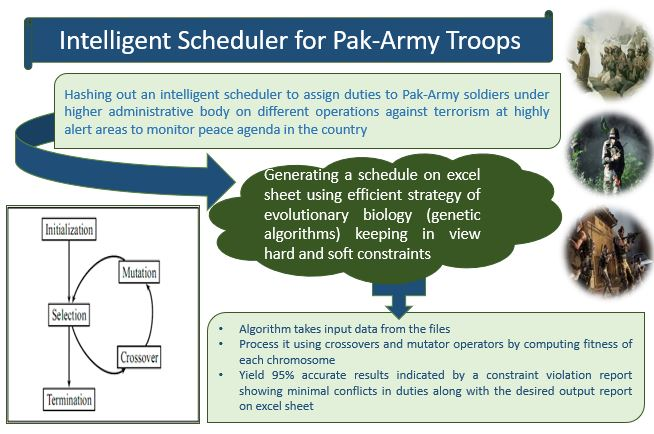

# Genetic Algorithm Scheduler For Pak Army Officers
Intelligent Scheduler using Genetic Algorithm with Specific Application to assign targeted operations and areas to Pakistan Army officers

# Task Definition
# Problem Statement:
Keeping in view the current status quo of terrorism threats faced by Lahore on certain upcoming public events, Pak-Army has requested us to service them by making a scheduler for different troops so that they can monitor the agenda to retain peace and order in the city by stopping terrorism and enforcing the law by striking criminals and spotting crimes. Project revolves around in generating a scheduler for different areas of Lahore. The main agenda of scheduler is to assign duties to Pak-Army troops commanded by a Major or Captain subjected to the security of that zone.

# Success Measurement of System:
In the long run, performance will be measured by how effectively every troop has been assigned to every area of city keeping in view the hard and soft constraints of the proposed plan.

# Literature Review
# Projects completed in the Domain:
Several similar projects e.g. school timetable, medical checkup appointment, exam scheduling etc. have been accomplished in the realm to achieve a timetable agenda which suits best the targeted problem domain. In such cases, the system usually takes different inputs like number of subjects, teachers, maximum lectures a teacher can conduct, priority of subject and topics to be covered in a week or a lecture, considering which, it will create feasible time tables for working days of the week, making excellent application of all resources in a way which will be best suited for the constraints. A suitable timetable is then chosen from the optimal solutions generated. All such projects either make use of genetic algorithms, simulated annealing or local search.

# Procedural Explanation of the Proposed System:
For generating a scheduler for Pak-Army, we will prefer to use genetic algorithms rather than simulated annealing or local search. In this case, scheduling is the allocation, subject to constraints, of given resources (Pak-Army troops) to objects (different areas of city) being placed in space time, in such a way as to satisfy as nearly as possible a set of desirable objectives. The constraints during generation of such a scheduler can be categorized into hard constraints that cannot be violated and soft constraints that are not vital but their satisfaction is highly desirable for a good quality solution to be processed. These constraints can be replicated in a format which will be managed by the scheduling algorithm in an organized manner. System would mechanically generate scheduler in accordance with all the possible constraints and the given inputs.

# Comparison with Existing Work
According to our study, GAs produced better timetables than simulated annealing but slightly worse timetables than local search. An advantage of GAs over both SA and LS is that GAs give the user the flexibility of choosing within a set of different schedules which, in turn, can make a timetable with a slightly higher cost more desirable than one with a lower cost. We will implement the following corrections in our proposal with respect to the work done earlier from viewpoint of genetic algorithms. We will: • change the representation of a solution in such a way that crossover can be applied consistently; • define new crossover and mutation operators which generate only feasible solutions; • apply the crossover and mutation operators and then make some kind of genetic repair that changes the infeasible solutions to feasible ones through the use of a filtering algorithm.

# Limitations of Study
Since, very few information is shared on the internet regarding Pak-Army troops so we will be making many assumptions throughout the project which might not coincide with the real paradigm. All attempts will be made to minimize the effects of our thought process and time constraints on the project.
